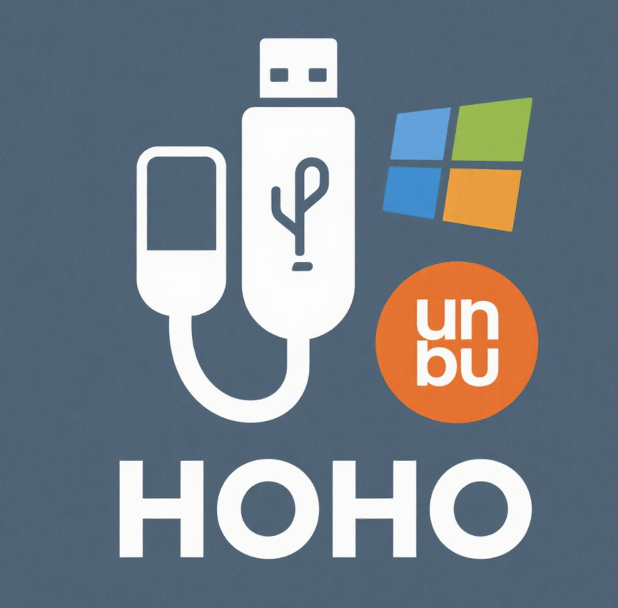

<p align="center">
    
</p>

# WSL USB Device Manager

I've experienced slow compilation when developing with Arduino IDE on Windows, so I installed Arduino IDE in WSL2 instead. However, since device binding was cumbersome, I used AI to generate an automated binding tool. This tool is just a single Python file - super convenient!

A powerful cross-platform USB device management tool specifically designed for WSL (Windows Subsystem for Linux) environments, with perfect compatibility for both Windows and Linux systems.

作者在Windows Arduino IDE上开发编译很慢，于是在WSL2中安装了Arduino IDE，由于设备绑定繁琐，便使用AI生成了自动绑定的工具。

该工具仅仅一个Python文件，超级方便！

一个强大的WSL USB设备管理工具，专为WSL(Windows Subsystem for Linux)环境设计，同时完美兼容Windows和Linux(WSL2)中运行。

## ⭐ 喜欢这个项目吗？

如果这个项目对你有帮助，请考虑给我们一个 **Star** ⭐！

👆 点击右上角的 ⭐ **Star** 按钮！

## ✨ 特性

### 🔄 跨平台兼容性
- **三重系统支持**: 原生支持Windows、WSL、Linux环境
- **智能环境检测**: 自动识别运行环境并调整行为
- **统一界面体验**: 在不同平台上保持一致的用户界面

### 🛠️ 基于原生工具
- **使用Windows内置usbipd**: 无需额外安装第三方驱动或工具
- **官方命令集成**: 完全基于Microsoft官方的usbipd命令行工具
- **稳定可靠**: 依托Windows系统原生支持，稳定性有保障

### 🔐 智能权限管理
- **自动权限检测**: 智能识别当前权限级别
- **一键权限提升**: Windows下自动请求管理员权限
- **友好权限提示**: Linux/WSL下提供清晰的权限指导

### 🖥️ 直观图形界面
- **现代化GUI**: 基于tkinter构建的用户友好界面
- **实时状态更新**: 动态显示USB设备连接状态
- **双击快捷操作**: 支持双击快速绑定/分离设备
- **详细操作日志**: 完整记录所有操作过程

### 🚀 高性能设计
- **异步操作**: 多线程处理，避免界面冻结
- **智能连接维持**: 自动监控和维护设备连接
- **优雅清理机制**: 程序退出时自动清理所有连接

### 🔧 易用性特性
- **设备自动发现**: 一键刷新所有可用USB设备
- **批量设备管理**: 支持一键分离所有已连接设备
- **连接状态监控**: 实时显示已连接设备数量和详情
- **容错设计**: 网络中断或设备意外断开时自动重连

## 📋 功能特性

- 🔍 **设备发现**: 自动扫描并列出所有可用的USB设备
- 🔗 **设备绑定**: 将USB设备绑定到WSL环境
- 📱 **设备附加**: 将绑定的设备附加到WSL子系统
- 🔌 **设备分离**: 安全地分离已连接的USB设备
- 🧹 **批量管理**: 一键分离所有已连接的设备
- 📊 **状态监控**: 实时显示设备连接状态和操作日志
- ⚡ **快速操作**: 双击设备即可快速绑定或分离

## 📦 使用说明

### 1. 直接使用（Windows）

下载右侧 Release 中的 EXE 文件执行。

## 📦 运行源码

### 1. 安装usbipd (仅Windows需要)

如果是Windows环境，请先安装usbipd：

```bash
winget install usbipd
```

或者从 [Microsoft Store](https://www.microsoft.com/store/productId/9P21XNV8F36X) 安装。

### 2. 克隆项目

```bash
git clone <repository-url>
cd wsl-usb-manager
```

### 3. 安装Python依赖

```bash
pip install -r requirements.txt
```

### 4. 运行程序

```bash
python usb_manager.py
```

## 🚀 使用方法

1. **启动程序**: 运行 `python usb_manager.py`
2. **权限检查**: 首次运行时程序会自动检查并请求必要权限
3. **刷新设备**: 点击"刷新设备"按钮扫描可用USB设备
4. **绑定设备**: 选择要使用的设备，点击"绑定并附加"
5. **使用设备**: 设备现在可以在WSL环境中正常使用
6. **分离设备**: 使用完毕后点击"分离"安全断开连接

### 快捷操作
- **双击设备**: 快速绑定未连接的设备或分离已连接的设备
- **Ctrl+R**: 刷新设备列表
- **一键分离**: 程序退出时可选择自动分离所有设备

## 🔧 故障排除

### 常见问题

**Q: 设备绑定失败，提示权限不足**
A: 确保程序以管理员权限运行(Windows)或使用sudo(Linux)

**Q: 找不到usbipd命令**
A: 请先安装usbipd工具: `winget install usbipd`

**Q: 设备连接后无法在WSL中访问**
A: 检查WSL2是否正确安装，尝试重启WSL服务

**Q: 程序无法启动**
A: 检查Python版本(需要3.6+)和依赖包安装

### 日志分析
程序提供详细的操作日志，遇到问题时请查看日志窗口中的错误信息。

- [Microsoft usbipd-win](https://github.com/microsoft/usbipd-win)
- [WSL官方文档](https://docs.microsoft.com/zh-cn/windows/wsl/)
- [Python tkinter文档](https://docs.python.org/3/library/tkinter.html)
